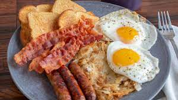

# Break Fast Notes
<!-- Notes  -->
People in the United States go to breakfast meal includes eggs, meat, potatoes, breads, pancakes, waffles, cereals, fruit, and yogurt
<!-- Images -->

<!-- Notes -->
Steak is commonly paired with eggs for a hearty breakfast.

Round tip steaks are often used for breakfast because the cut is tender.

It is usually cooked to order.
<!-- Steak -->

Bacon comes from the side of a pig, and is cured and often smoked for flavor.

Most food service operations purchase pork bacon that is already sliced,although it is available in whole slabs. 

To help reduce shrinkage, cook bacon at a low temperature.
<!-- Bacon -->

