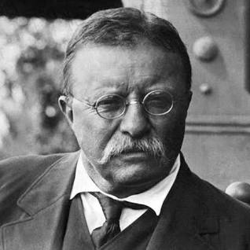
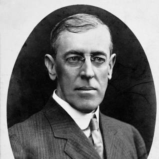
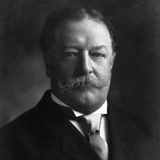

# U.S History
<!--  Notes  -->
Teddy roosevelt didn't like the idea of the european taking the debts from santo domingo so he decided to use force to get the debts instead.
<!-- Teddy roosevelt -->

<!-- Notes -->
President wilson wanted latin american countries not to have dictators but mexico didn't follow that rule which caused wilson to be angered
<!-- Wilson -->

<!-- Notes -->
President Taft wanted to pay back the european's debt so he decided to invade nicaragua
<!-- Taft -->

